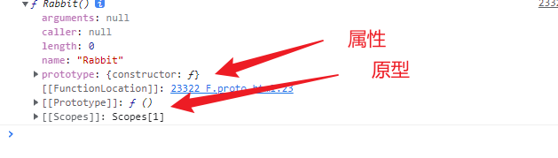
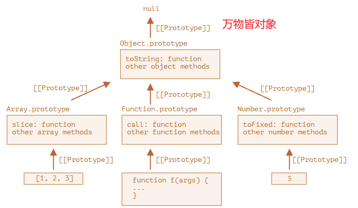

## bind

一个函数不能被重绑定（re-bound）

```javascript
let user = {
    firstName: "John",
    sayHi() {
        alert(`Hello, ${this.firstName}!`);
    }
};
// setTimeout(function() {
// user.sayHi(); // Hello, John!
// }, 1000); 与箭头等价
setTimeout(() => user.sayHi(), 1000); 
//改变user的值
user = {
    sayHi() { alert("Another user in setTimeout!"); 	}
};
```

​            如果在 setTimeout 触发之前（有一秒的延迟！）user 的值改变了怎那么，突然间，它将调用错误的对象！

​            解决方法：bind
​           

```js
let user = {
    firstName: "John",
    sayHi() {
        alert(`Hello, ${this.firstName}!`);
    }
};
let sayHi = user.sayHi.bind(user); // (*)
sayHi(); // Hello, John!

setTimeout(sayHi, 1000); // Hello, John!

//改变user的值
user = {
    sayHi() { alert("Another user in setTimeout!"); }
};
```

​            在 (*) 行，我们取了方法 user.sayHi 并将其绑定到 user。sayHi 是一个“绑定后（bound）”的方法，它可以被单独调用，也可以被传递给 setTimeout —— 都没关系，函数上下文都会是正确的。


### bind、call、apply有什么异同

bind、call、apply三种方法都可以用来改变函数中this的指向。

bind方法会**返回一个新的函数**，新函数中this的指向被绑定为bind的第一个参数(**对象**)，后面的参数将作为新函数的参数。

call方法和apply方法的作用相同，都是**立即调用函数**，且**第一个参数**将作为**函数中的this指向**，**后面的参数将作为函数的参数**，不同之处在于call方法的参数是一个一个传入，而apply方法的参数是作为一个**数组**传入。`call` 和 `apply` 之间唯一的语法区别是，`call` 期望一个参数列表，而 `apply` 期望一个包含这些参数的**类数组对象**。

1. 使用bind方法

```javascript
let obj1 = {
  name: '小明',
  sayHi() {
    console.log(`你好，我是${this.name}`);
  }
};

let obj2 = {
  name: '小红'
};

let sayHi = obj1.sayHi.bind(obj2);
sayHi(); // 输出：你好，我是小红
```

在这个例子中，我们定义了两个对象`obj1`和`obj2`，分别有一个`name`属性和一个`sayHi`方法。我们想要使用`obj2`的`name`属性来调用`obj1`的`sayHi`方法，这时可以使用`bind`方法将`obj1`的`sayHi`方法中的`this`指向绑定为`obj2`，从而达到目的。

1. 使用call方法 `func.call(context, arg1, arg2, ...)`

```javascript
function add(a, b) {
  return a + b;
}

let result = add.call(null, 1, 2);
console.log(result); // 输出：3
```

在这个例子中，我们定义了一个函数`add`，这个函数接受两个参数，返回它们的和。我们想要立即调用`add`函数并传入参数1和2，这时可以使用`call`方法，将`add`函数中的`this`指向为`null`，后面的参数分别为1和2。

1. 使用apply方法 `func.apply(context, args)`

```javascript
function max(arr) {
  return Math.max.apply(null, arr);
}

let result = max([1, 2, 3]);
console.log(result); // 输出：3
```

在这个例子中，我们定义了一个函数`max`，这个函数接受一个数组参数，返回这个数组中的最大值。我们想要立即调用`max`函数并传入一个数组参数，这时可以使用`apply`方法，将`max`函数中的`this`指向为`null`，后面的参数为一个数组。

## arguments

在JavaScript中，`arguments`是一个特殊的对象，它表示当前函数被调用时传递的所有参数（包括无名参数和命名参数）。可以通过`arguments`对象来访问这些参数。

`arguments`对象的属性和方法如下：

1. `length`：表示当前函数调用时传递的参数个数。
2. `callee`：指向当前正在执行的函数对象，也就是当前函数自身。
3. `caller`：指向调用当前函数的函数，如果当前函数不是由其他函数调用，则返回null。
4. `index`：表示当前正在处理的参数的位置，从0开始计数。
5. `toString()`：返回当前`arguments`对象的字符串表示。

由于`arguments`对象具有数组的一些特性，可以通过下标来访问其中的参数，也可以遍历`arguments`对象来访问其中的所有参数。

需要注意的是，在严格模式下，不允许修改`arguments`对象中的属性和方法，也不允许使用`arguments.callee`来调用函数自身，这是为了避免一些安全和可维护性问题


在箭头函数中，确实没有`arguments`对象，但是可以通过函数参数的方式来获取函数的所有参数。

## 箭头函数

箭头函数是通过词法作用域来绑定上下文的，因此没有自己的`this`、`arguments`、`super` 和 `new.target`。这意味着在箭头函数内部引用`this`、`arguments`、`super` 或 `new.target`时，它们会从父作用域中继承，而不是从函数自身绑定。

在箭头函数中，可以通过REST参数语法获取函数的所有参数，例如：

```javascript
const sum = (...args) => {
  let total = 0;
  for (let arg of args) {
    total += arg;
  }
  return total;
};

console.log(sum(1, 2, 3)); // 输出：6
```

在这个例子中，我们使用REST参数语法`...args`来获取函数的所有参数，并在函数内部进行求和操作。

需要注意的是，由于箭头函数没有自己的作用域，因此不能通过`arguments.callee`来引用函数自身。如果想要递归调用箭头函数，需要使用普通函数来实现。

## getter和setter

getter和setter的主要作用是封装数据和保护数据的完整性，使得程序员可以在不暴露内部实现的情况下，通过一定的逻辑来处理数据。例如，通过getter和setter可以对属性进行验证、类型转换、计算属性等操作。这样可以避免直接访问属性时对属性的误操作，保证属性的正确性和安全性。


## JS中的继承通过原型链实现




- `F.prototype` 属性（不要把它与 `[[Prototype]]` 弄混了）在 `new F` 被调用时为新对象的 `[[Prototype]]` 赋值。
- `F.prototype` 的值要么是一个对象，要么就是 `null`：其他值都不起作用。
- `"prototype"` 属性仅当设置在一个构造函数上，并通过 `new` 调用时，才具有这种特殊的影响。

​		默认情况下，所有函数都有 `F.prototype = {constructor：F}`，所以我们可以通过访问它的 `"constructor"` 属性来获取一个对象的构造器。


​		Object.prototype 上方的链中没有更多的 [[Prototype]]

​		


现代的获取/设置原型的方法有：

- [Object.getPrototypeOf(obj) —— 返回对象 `obj` 的 `[[Prototype]]`。
- [Object.setPrototypeOf(obj, proto) —— 将对象 `obj` 的 `[[Prototype]]` 设置为 `proto`。

`__proto__` 不被反对的唯一的用法是在创建新对象时，将其用作属性：`{ __proto__: ... }`。

虽然，也有一种特殊的方法：

- [Object.create(proto, [descriptors\])](https://developer.mozilla.org/zh/docs/Web/JavaScript/Reference/Global_Objects/Object/create) —— 利用给定的 `proto` 作为 `[[Prototype]]` 和可选的属性描述来创建一个空对象。

​	例如：

```javascript
let animal = {
  eats: true
};

// 创建一个以 animal 为原型的新对象
let rabbit = Object.create(animal); // 与 {__proto__: animal} 相同

alert(rabbit.eats); // true

alert(Object.getPrototypeOf(rabbit) === animal); // true

Object.setPrototypeOf(rabbit, {}); // 将 rabbit 的原型修改为 {}
```

`__proto__` 是一种访问 `[[Prototype]]` 的方式，而不是 `[[prototype]]` 本身

`__proto__` 属性很特殊：它必须是一个对象或者 `null`。字符串不能成为原型。这就是为什么将字符串赋值给 `__proto__` 会被忽略


