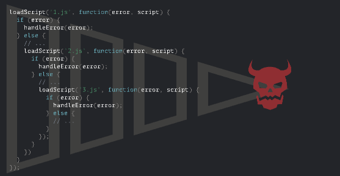
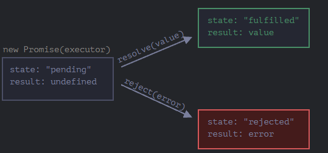
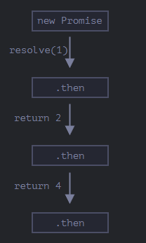
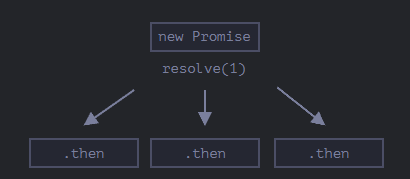
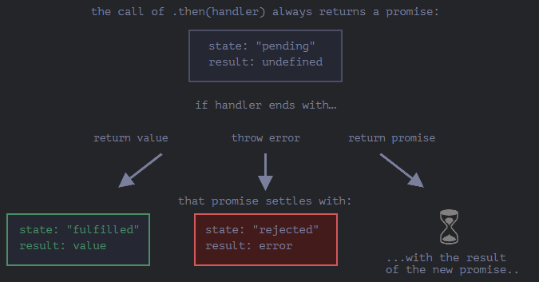
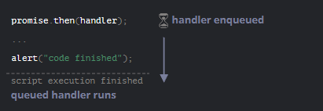
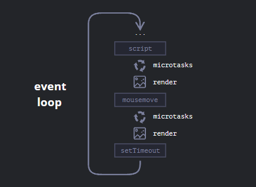

# Promise，async/await

## Intro 回调 ：解决异步

js提供的函数允许我们计划**异步**行为

eg. `setTimeout`；加载模块和脚本：**先加载**，html全部加载完**再执行**

添加一个 `callback` 函数作为 `loadScript` 的第二个参数，该函数应在脚本加载完成时执行：

```javascript
function loadScript(src, callback) {
  let script = document.createElement('script');
  script.src = src;

  script.onload = () => callback(script);
//不用箭头函数封装会直接执行 ：箭头函数不会创建自己的执行上下文，而是继承外部作用域的this值和变量绑定，在事件触发时才会执行箭头函数内部的代码
    
  document.head.append(script);
}
```

`onload` 事件，它通常会在脚本加载和执行完成后执行一个函数。

### 回调中回调

我们如何依次加载两个脚本：第一个，然后是第二个？

自然的解决方案是将第二个 `loadScript` 调用放入回调中，如下所示：

```javascript
loadScript('/my/script.js', function(script) {
  alert(`酷，脚本 ${script.src} 加载完成，让我们继续加载另一个吧`);
  loadScript('/my/script2.js', function(script) {
    alert(`酷，第二个脚本加载完成`);
       loadScript('/my/script3.js', function(script) {
      // ...加载完所有脚本后继续
    });
  });
});
```

在外部 `loadScript` 执行完成时，回调就会发起内部的 `loadScript`。

因此，每一个新行为（action）都在回调内部。多层非常**不优雅**

### 处理Error

加载成功时，它会调用 `callback(null, script)`，否则调用 `callback(error)`。

用法：

```javascript
loadScript('/my/script.js', function(error, script) {
  if (error) {
    // 处理 error
  } else {
    // 脚本加载成功
  }
});
```

再次强调，在 `loadScript` 中所使用的方案其实很普遍。它被称为“Error 优先回调（error-first callback）”风格。

约定是：

1. `callback` 的第一个参数是为 error 而保留的。一旦出现 error，`callback(err)` 就会被调用。
2. 第二个参数（和下一个参数，如果需要的话）用于成功的结果。此时 `callback(null, result1, result2…)` 就会被调用。

因此，单一的 `callback` 函数可以同时具有报告 error 和传递返回结果的作用。

### 回调地狱

对于一个接一个的多个异步行为，代码将会变成这样：



嵌套调用的“金字塔”随着每个异步行为会向右增长。很快它就失控了

因此引入 *“promise”*

## Promise

### Intro

1. “生产者代码（producing code）”会做一些事儿，并且会需要一些时间。例如，通过网络加载数据的代码。它就像一位“歌手”。
2. “消费者代码（consuming code）”想要在“生产者代码”完成工作的第一时间就能获得其工作成果。许多函数可能都需要这个结果。这些就是“粉丝”。
3. **Promise** 是将“生产者代码”和“消费者代码”连接在一起的一个特殊的 JavaScript 对象。用我们的类比来说：这就是就像是“订阅列表”。“生产者代码”花费它所需的任意长度时间来产出所承诺的结果，而 “promise” 将在它（译注：指的是“生产者代码”，也就是下文所说的 executor）准备好时，将结果向所有订阅了的代码开放。

Promise 对象的构造器（constructor）语法如下：

```javascript
let promise = new Promise(function(resolve, reject) {
  // executor（生产者代码，“歌手”）
  //resolve （成功）, reject（失败） 都是js提供的回调函数
});
```

executor 会自动运行并尝试执行一项工作。尝试结束后，如果成功则调用 `resolve`，如果出现 error 则调用 `reject`。



1. executor 被自动且立即调用（通过 `new Promise`）。

2. executor 接受两个参数：`resolve` 和 `reject`。这些函数由 JavaScript 引擎预先定义，因此我们不需要创建它们。我们只需要在准备好（译注：指的是 executor 准备好）时调用其中之一即可

   

   *executor 只能调用一个 `resolve` 或一个 `reject`。任何状态的更改都是最终的。*

   *所有其他的再对 `resolve` 和 `reject` 的调用都会被忽略*

   ***`state` 和 `result` 都是内部的***

   *Promise 对象的 `state` 和 `result` 属性都是内部的。我们无法直接访问它们。但我们可以对它们使用 `.then`/`.catch`/`.finally` 方法。我们在下面对这些方法进行了描述。*

### 消费者：then,catch

**then**

`.then` 的第一个参数是一个函数，该函数将在 promise resolved 且接收到结果后执行。

`.then` 的第二个参数也是一个函数，该函数将在 promise rejected 且接收到 error 信息后执行。

例如，以下是对成功 resolved 的 promise 做出的反应：

```javascript
let promise = new Promise(function(resolve, reject) {
  setTimeout(() => resolve("done!"), 1000);
});

// resolve 运行 .then 中的第一个函数
promise.then(
  result => alert(result), // 1 秒后显示 "done!"
  error => alert(error) // 不运行
);
```

在 reject 的情况下，运行第二个：

```javascript
let promise = new Promise(function(resolve, reject) {
  setTimeout(() => reject(new Error("Whoops!")), 1000);
});

// reject 运行 .then 中的第二个函数
promise.then(
  result => alert(result), // 不运行
  error => alert(error) // 1 秒后显示 "Error: Whoops!"
);
```

如果我们只对成功完成的情况感兴趣，那么我们可以只为 `.then` 提供一个函数参数：

```javascript
let promise = new Promise(resolve => {
  setTimeout(() => resolve("done!"), 1000);
});

promise.then(alert); // 1 秒后显示 "done!"
```

**catch**

如果我们只对 error 感兴趣，那么我们可以使用 `null` 作为第一个参数：`.then(null, errorHandlingFunction)`。或者我们也可以使用 `.catch(errorHandlingFunction)`，其实是一样的：

```javascript
let promise = new Promise((resolve, reject) => {
  setTimeout(() => reject(new Error("Whoops!")), 1000);
});

// .catch(f) 与 promise.then(null, f) 一样
promise.catch(alert); // 1 秒后显示 "Error: Whoops!"
```

`.catch(f)` 调用是 `.then(null, f)` 的完全的模拟，它只是一个简写形式。

### 清理：finally   

**must do 并不是结尾**

`finally` 的功能是设置一个处理程序在前面的操作完成后，执行清理/终结。类似于 `then(f,f)` 

例如，停止加载指示器，关闭不再需要的连接等。

1. `finally` 处理程序没有参数。在 `finally` 中，我们不知道 promise 是否成功。没关系，因为我们的任务通常是执行“常规”的完成程序（finalizing procedures）。

2. `finally` 处理程序将结果或 error “传递”给下一个合适的处理程序。

3. `finally` 处理程序也不应该返回任何内容。如果它返回了，返回的值会默认被忽略。

   此规则的唯一例外是当 `finally` 处理程序抛出 error 时。此时这个 error（而不是任何之前的结果）会被转到下一个处理程序。

### eg: loadScript

新函数 `loadScript` 将不需要回调。取而代之的是，它将创建并返回一个在加载完成时 resolve 的 promise 对象。外部代码可以使用 `.then` 向其添加处理程序（订阅函数）：

```javascript
function loadScript(src) {
  return new Promise(function(resolve, reject) {
    let script = document.createElement('script');
    script.src = src;

    script.onload = () => resolve(script);
    script.onerror = () => reject(new Error(`Script load error for ${src}`));

    document.head.append(script);
  });
}
```

用法：

```javascript
let promise = loadScript("https://cdnjs.cloudflare.com/ajax/libs/lodash.js/4.17.11/lodash.js");

promise.then(
  script => alert(`${script.src} is loaded!`),
  error => alert(`Error: ${error.message}`)
);

promise.then(script => alert('Another handler...'));
```

**异步代码同步化**

promise 允许我们按照自然顺序进行编码。首先，我们运行 `loadScript` 和 `.then` 来处理结果。

我们可以根据需要，在 promise 上多次调用 `.then`。每次调用，我们都会在“订阅列表”中添加一个新的“粉丝”，一个新的订阅函数

## Promise链

它看起来就像这样：

```javascript
new Promise(function(resolve, reject) {

  setTimeout(() => resolve(1), 1000); // (*)

}).then(function(result) { // (**)

  alert(result); // 1
  return result * 2;

}).then(function(result) { // (***)

  alert(result); // 2
  return result * 2;

}).then(function(result) {

  alert(result); // 4
  return result * 2;

});
```

通过 `.then` 处理程序（handler）链进行传递 result。

运行流程如下：

1. 初始 promise 在 1 秒后 resolve `(*)`，
2. 然后 `.then` 处理程序被调用 `(**)`，它又创建了一个新的 promise（以 `2` 作为值 resolve）。
3. 下一个 `then` `(***)` 得到了前一个 `then` 的值，对该值进行处理（*2）并将其传递给下一个处理程序。
4. ……依此类推。

随着 result 在处理程序链中传递，我们可以看到一系列的 `alert` 调用：`1` → `2` → `4`。



这样之所以是可行的，是因为每个对 `.then` 的调用都会**返回了一个新的 promise**，因此我们可以在其之上调用下一个 `.then`。

当处理程序返回一个值时，它将成为该 promise 的 result，所以将使用它调用下一个 `.then`。

**从技术上讲，我们也可以将多个 `.then` 添加到一个 promise 上。但这并不是 promise 链（chaining）**

例如：

```javascript
let promise = new Promise(function(resolve, reject) {
  setTimeout(() => resolve(1), 1000);
});

promise.then(function(result) {
  alert(result); // 1
  return result * 2;
});

promise.then(function(result) {
  alert(result); // 1
  return result * 2;
});

promise.then(function(result) {
  alert(result); // 1
  return result * 2;
});
```



### 返回promise

返回 promise 使我们能够构建异步行为链

### eg: loadScript

 上一章中定义的 promise 化的 `loadScript` 结合使用，按顺序依次加载脚本：

```javascript
loadScript("/article/promise-chaining/one.js")
  .then(script => loadScript("/article/promise-chaining/two.js"))
  .then(script => loadScript("/article/promise-chaining/three.js"))
  .then(script => {
    // 脚本加载完成，我们可以在这儿使用脚本中声明的函数
    one();
    two();
    three();
  });
```

**Thenables**:一个具有方法 `.then` 的任意对象。它会被当做一个 promise 来对待

这个特性允许我们将自定义的对象与 promise 链集成在一起，而不必继承自 `Promise`

### fetch

基本语法很简单：

```javascript
let promise = fetch(url);
```

**执行这条语句，向 `url` 发出网络请求并返回一个 promise。**当远程服务器返回 header（是在 **全部响应加载完成前**）时，该 promise 使用一个 `response` 对象来进行 resolve。

为了读取完整的响应，我们应该调用 `response.text()` 方法：当全部文字内容从远程服务器下载完成后，它会返回一个 promise，该 promise 以刚刚下载完成的这个文本作为 result 进行 resolve。

下面这段代码向 `user.json` 发送请求，并从服务器加载该文本：

```javascript
fetch('/article/promise-chaining/user.json')
  // 当远程服务器响应时，下面的 .then 开始执行
  .then(function(response) {
    // 当 user.json 加载完成时，response.text() 会返回一个新的 promise
    // 该 promise 以加载的 user.json 为 result 进行 resolve
    return response.text();
  })
  .then(function(text) {
    // ……这是远程文件的内容
    alert(text); // {"name": "iliakan", "isAdmin": true}
  });
```

从 `fetch` 返回的 `response` 对象还包含 `response.json()` 方法，该方法可以读取远程数据并将其解析为 JSON

例如 ，我们可以再向 GitHub 发送一个请求，加载用户个人资料并显示头像：

```javascript
// 发送一个对 user.json 的请求
fetch('/article/promise-chaining/user.json')
  // 将其加载为 JSON
  .then(response => response.json())
  // 发送一个到 GitHub 的请求
  .then(user => fetch(`https://api.github.com/users/${user.name}`))
  // 将响应加载为 JSON
  .then(response => response.json())
  // 显示头像图片（githubUser.avatar_url）3 秒（也可以加上动画效果）
  .then(githubUser => {
    let img = document.createElement('img');
    img.src = githubUser.avatar_url;
    img.className = "promise-avatar-example";
    document.body.append(img);

    setTimeout(() => img.remove(), 3000); // (*)
  });
```

作为一个好的做法，异步行为应该始终返回一个 promise。这样就可以使得之后我们计划后续的行为成为可能。即使我们现在不打算对链进行扩展，但我们之后可能会需要。

我们可以将代码拆分为可重用的 <span id="showAvatar">函数</span>：

```javascript
function loadJson(url) {
  return fetch(url)
    .then(response => response.json());
}

function loadGithubUser(name) {
  return loadJson(`https://api.github.com/users/${name}`);
}

function showAvatar(githubUser) {
  return new Promise(function(resolve, reject) {
    let img = document.createElement('img');
    img.src = githubUser.avatar_url;
    img.className = "promise-avatar-example";
    document.body.append(img);

    setTimeout(() => {
      img.remove();
      resolve(githubUser);
    }, 3000);
  });
}

// 使用它们：
loadJson('/article/promise-chaining/user.json')
  .then(user => loadGithubUser(user.name))
  .then(showAvatar)
  .then(githubUser => alert(`Finished showing ${githubUser.name}`));
  // ...
```

### 总结

如果 `.then`（或 `catch/finally` 都可以）处理程序返回一个 promise，那么链的其余部分将会等待，直到它状态变为 settled。当它被 settled 后，其 result（或 error）将被进一步传递下去。



## Promise错误处理

promise 链在错误（error）处理中十分强大。当一个 promise 被 reject 时，控制权将移交至最近的 rejection 处理程序。

例如，下面代码中所 `fetch` 的 URL 是错的（没有这个网站），`.catch` 对这个 error 进行了处理：

```javascript
fetch('https://no-such-server.blabla') // reject
  .then(response => response.json())
  .catch(err => alert(err)) // TypeError: Failed to fetch（这里的文字可能有所不同）
```

`.catch` 不必是立即的。它可能在一个或多个 `.then` 之后出现。

或者，可能该网站一切正常，但响应不是有效的 JSON。**捕获所有 error 的最简单的方法是，将 `.catch` 附加到链的末尾**

隐式try...catch

下面这段代码：

```javascript
new Promise((resolve, reject) => {
  throw new Error("Whoops!");
}).catch(alert); // Error: Whoops!
```

……与下面这段代码工作上完全相同：

```javascript
new Promise((resolve, reject) => {
  reject(new Error("Whoops!"));
}).catch(alert); // Error: Whoops!
```

在 executor 周围的“隐式 `try..catch`”自动捕获了 error，并将其变为 rejected promise。

这不仅仅发生在 executor 函数中，同样也发生在其处理程序中。如果我们在 `.then` 处理程序中 `throw`，这意味着 promise rejected，因此控制权移交至最近的 error 处理程序。

### Rethrowing

在常规的 `try..catch` 中，我们可以分析 error，如果我们无法处理它，可以将其再次抛出。对于 promise 来说，这也是可以的。

如果我们在 `.catch` 中 `throw`，那么控制权就会被移交到下一个最近的 error 处理程序。如果我们处理该 error 并正常完成，那么它将继续到最近的成功的 `.then` 处理程序。

`(*)` 行的处理程序捕获了 error，但无法处理它（例如，它只知道如何处理 `URIError`），所以它将其再次抛出：

```javascript
// 执行流：catch -> catch
new Promise((resolve, reject) => {

  throw new Error("Whoops!");

}).catch(function(error) { // (*)

  if (error instanceof URIError) {
    // 处理它
  } else {
    alert("Can't handle such error");

    throw error; // 再次抛出此 error 或另外一个 error，执行将跳转至下一个 catch
  }

}).then(function() {
  /* 不在这里运行 */
}).catch(error => { // (**)

  alert(`The unknown error has occurred: ${error}`);
  // 不会返回任何内容 => 执行正常进行

});
```

执行从第一个 `.catch` `(*)` 沿着链跳转至下一个 `(**)`

### 未处理的rejection

当发生一个常规的 error 并且未被 `try..catch` 捕获时会发生什么？脚本死了，并在控制台中留下了一个信息。对于在 promise 中未被处理的 rejection，也会发生类似的事。

JavaScript 引擎会跟踪此类 rejection，在这种情况下会生成一个全局的 error。如果你运行上面这个代码，你可以在控制台中看到。

在浏览器中，我们可以使用 `unhandledrejection` 事件来捕获这类 error：

```javascript
window.addEventListener('unhandledrejection', function(event) {
  // 这个事件对象有两个特殊的属性：
  alert(event.promise); // [object Promise] —— 生成该全局 error 的 promise
  alert(event.reason); // Error: Whoops! —— 未处理的 error 对象
});

new Promise(function() {
  throw new Error("Whoops!");
}); // 没有用来处理 error 的 catch
```

### 总结

- `.catch` 处理 promise 中的各种 error：在 `reject()` 调用中的，或者在处理程序中抛出的 error。
- 如果给定 `.then` 的第二个参数（即 error 处理程序），那么 `.then` 也会以相同的方式捕获 error。
- 我们应该将 `.catch` 准确地放到我们想要处理 error，并知道如何处理这些 error 的地方。处理程序应该分析 error（可以自定义 error 类来帮助分析）并再次抛出未知的 error（它们可能是编程错误）。
- 如果没有办法从 error 中恢复，不使用 `.catch` 也可以。
- 在任何情况下我们都应该有 `unhandledrejection` 事件处理程序（用于浏览器，以及其他环境的模拟），以跟踪未处理的 error 并告知用户（可能还有我们的服务器）有关信息，以使我们的应用程序永远不会“死掉”。

## Promise API

### Promise.all 

假设我们希望并行执行多个 promise，并等待所有 promise 都准备就绪。

例如，并行下载几个 URL，并等到所有内容都下载完毕后再对它们进行处理。

语法：

```javascript
let promise = Promise.all(iterable);
```

`Promise.all` 接受一个可迭代对象（通常是一个数组项为 promise 的数组），并返回一个新的 promise。

当所有给定的 promise 都 resolve 时，新的 promise 才会 resolve，并且其结果数组将成为新 promise 的结果。

将一个任务数据数组映射（map）到一个 promise 数组，然后将其包装到 `Promise.all`。

例如，如果我们有一个存储 URL 的数组，我们可以像这样 fetch 它们：

```javascript
let urls = [
  'https://api.github.com/users/iliakan',
  'https://api.github.com/users/remy',
  'https://api.github.com/users/jeresig'
];

// 将每个 url 映射（map）到 fetch 的 promise 中
let requests = urls.map(url => fetch(url));

// Promise.all 等待所有任务都 resolved
Promise.all(requests)
  .then(responses => responses.forEach(
    response => alert(`${response.url}: ${response.status}`)
  ));
```

**如果任意一个 promise 被 reject，由 `Promise.all` 返回的 promise 就会立即 reject，并且带有的就是这个 error**（如果有多个同时进行的 `fetch` 调用，其中一个失败，其他的 `fetch` 操作仍然会继续执行，但是 `Promise.all` 将不会再关心（watch）它们。它们可能会 settle，但是它们的结果将被忽略。）

`Promise.all(iterable)` **允许在** `iterable` **中使用非 promise 的“常规”值**

### Promise.allSettled   

`Promise.allSettled` 等待所有的 promise 都被 settle，无论结果如何。结果数组具有：

- `{status:"fulfilled", value:result}` 对于成功的响应，
- `{status:"rejected", reason:error}` 对于 error。

例如，我们想要获取（fetch）多个用户的信息。即使其中一个请求失败，我们仍然对其他的感兴趣。

让我们使用 `Promise.allSettled`：

```javascript
let urls = [
  'https://api.github.com/users/iliakan',
  'https://api.github.com/users/remy',
  'https://no-such-url'
];

Promise.allSettled(urls.map(url => fetch(url)))
  .then(results => { // (*)
    results.forEach((result, num) => {
      if (result.status == "fulfilled") {
        alert(`${urls[num]}: ${result.value.status}`);
      }
      if (result.status == "rejected") {
        alert(`${urls[num]}: ${result.reason}`);
      }
    });
  });
```

上面的 `(*)` 行中的 `results` 将会是：

```javascript
[
  {status: 'fulfilled', value: ...response...},
  {status: 'fulfilled', value: ...response...},
  {status: 'rejected', reason: ...error object...}
]
```

所以，对于每个 promise，我们都得到了其状态（status）和 `value/reaso`

### Polyfill

如果浏览器（仅IE）不支持 `Promise.allSettled`，很容易进行 polyfill(手写一个 `allSettled`)：

```javascript
if (!Promise.allSettled) {
  const rejectHandler = reason => ({ status: 'rejected', reason });

  const resolveHandler = value => ({ status: 'fulfilled', value });

  Promise.allSettled = function (promises) {
    const convertedPromises = promises.map(p => Promise.resolve(p).then(resolveHandler, rejectHandler));
    return Promise.all(convertedPromises);
  };
}
```

在这段代码中，`promises.map` 获取输入值，并通过 `p => Promise.resolve(p)` 将输入值转换为 promise（以防传递了非 promise 值），然后向每一个 promise 都添加 `.then` 处理程序。

这个处理程序将成功的结果 `value` 转换为 `{status:'fulfilled', value}`，将 error `reason` 转换为 `{status:'rejected', reason}`。这正是 `Promise.allSettled` 的格式。

然后我们就可以使用 `Promise.allSettled` 来获取 **所有** 给定的 promise 的结果，即使其中一些被 reject。

### Promise.race

与 `Promise.all` 类似，但只等待第一个 settled 的 promise 并获取其结果（或 error）。

语法：

```javascript
let promise = Promise.race(iterable);
```

### Promise.any

与 `Promise.race` 类似，区别在于 `Promise.any` **只等待第一个 fulfilled 的 promise，并将这个 fulfilled 的 promise 返回**。如果给出的 promise 都 rejected，那么返回的 promise 会带有 `AggregateError` —— 一个特殊的 error 对象，在其 `errors` 属性中存储着所有 promise error。

语法如下：

```javascript
let promise = Promise.any(iterable);
```

### Promise.resolve/reject

在现代的代码中，很少需要使用 `Promise.resolve` 和 `Promise.reject` 方法，因为 **`async/await`** 语法使它们变得有些过时了

`Promise.resolve(value)` 用结果 `value` 创建一个 resolved 的 promise。

如同：

```javascript
let promise = new Promise(resolve => resolve(value));
```

我们直接从缓存中获取了当前操作的结果 `value`，但是期望返回的是一个 promise，所以可以使用 `Promise.resolve(value)` 将 `value` “封装”进 promise，以满足期望返回一个 promise 的这个需求。

下面的 `loadCached` 函数获取（fetch）一个 URL 并记住其内容。以便将来对使用相同 URL 的调用，它能立即从缓存中获取先前的内容，但使用 `Promise.resolve` 创建了一个该内容的 promise，所以返回的值始终是一个 promise。

```javascript
let cache = new Map();

function loadCached(url) {
  if (cache.has(url)) {
    return Promise.resolve(cache.get(url)); // (*)
  }

  return fetch(url)
    .then(response => response.text())
    .then(text => {
      cache.set(url,text);
      return text;
    });
}
```

我们可以使用 `loadCached(url).then(…)`，因为该函数保证了会返回一个 promise。我们就可以放心地在 `loadCached` 后面使用 `.then`。这就是 `(*)` 行中 `Promise.resolve` 的目的。

`Promise.reject(error)` 用 `error` 创建一个 rejected 的 promise。

如同：

```javascript
let promise = new Promise((resolve, reject) => reject(error));
```

### 总结

`Promise` 类有 6 种静态方法：

1. `Promise.all(promises)` —— 等待所有 promise 都 resolve 时，返回存放它们结果的数组。如果给定的任意一个 promise 为 reject，那么它就会变成 `Promise.all` 的 error，所有其他 promise 的结果都会被忽略。
2. `Promise.allSettled(promises)`（ES2020 新增方法）—— 等待所有 promise 都 settle 时，并以包含以下内容的对象数组的形式返回它们的结果：
   - `status`: `"fulfilled"` 或 `"rejected"`
   - `value`（如果 fulfilled）或 `reason`（如果 rejected）。
3. `Promise.race(promises)` —— 等待第一个 settle 的 promise，并将其 result/error 作为结果返回。
4. `Promise.any(promises)`（ES2021 新增方法）—— 等待第一个 fulfilled 的 promise，并将其结果作为结果返回。如果所有 promise 都 rejected，`Promise.any` 则会抛出 `AggregateError` 错误类型的 error 实例。
5. `Promise.resolve(value)` —— 使用给定 value 创建一个 resolved 的 promise。
6. `Promise.reject(error)` —— 使用给定 error 创建一个 rejected 的 promise。

以上所有方法，`Promise.all` 可能是在实战中使用最多的。

## Microtask

promise 的处理程序 `.then`、`.catch` 和 `.finally` 都是异步的。

即便一个 promise 立即被 resolve，`.then`、`.catch` 和 `.finally` **下面** 的代码也会在这些处理程序之前被执行。

### Microtask queue

异步任务需要适当的管理。为此，ECMA 标准规定了一个内部队列 `PromiseJobs`，通常被称为“微任务队列（microtask queue）”（V8 术语）。

**同步任务执行完毕才会执行微任务队列**

如 规范 中所述：

- 队列（queue）是先进先出的：首先进入队列的任务会首先运行。
- 只有在 JavaScript 引擎中没有其它任务在运行时，才开始执行任务队列中的任务。

或者，简单地说，当一个 promise 准备就绪时，它的 `.then/catch/finally` 处理程序就会被放入队列中：但是它们不会立即被执行。当 JavaScript 引擎执行完当前的代码，它会从队列中获取任务并执行它。



promise 的处理程序总是会经过这个内部队列。

如果有一个包含多个 `.then/catch/finally` 的链，那么它们中的每一个都是异步执行的。也就是说，它会首先进入队列，然后在当前代码执行完成并且先前排队的处理程序都完成时才会被执行。

**如果执行顺序对我们很重要该怎么办？我们怎么才能让 `code finished` 在 `promise done` 之后出现呢？**

很简单，只需要像下面这样使用 `.then` 将其放入队列：

```javascript
Promise.resolve()
  .then(() => alert("promise done!"))
  .then(() => alert("code finished"));
```

现在代码就是按照预期执行的。

### 未处理的rejection

正常来说，如果我们预期可能会发生错误，我们会在 promise 链上添加 `.catch` 来处理 error：

但是如果我们忘记添加 `.catch`，那么，微任务队列清空后，JavaScript 引擎会触发下面这事件：

```javascript
let promise = Promise.reject(new Error("Promise Failed!"));

// Promise Failed!
window.addEventListener('unhandledrejection', event => alert(event.reason));
```

### 事件循环：宏任务和微任务

**事件循环** 的概念非常简单。它是一个在 JavaScript 引擎等待任务，执行任务和进入休眠状态等待更多任务这几个状态之间转换的无限循环。

微任务仅来自于我们的代码。它们通常是由 promise 创建的：对 `.then/catch/finally` 处理程序的执行会成为微任务。微任务也被用于 `await` 的“幕后”，因为它是 promise 处理的另一种形式。

**每个宏任务之后，引擎会立即执行微任务队列中的所有任务，然后再执行其他的宏任务，或渲染，或进行其他任何操作。**



```javascript
setTimeout(() => alert("timeout"));  //alert("timeout") 添加到宏任务队列

Promise.resolve()
  .then(() => alert("promise")); //异步.then 添加到微任务队列

alert("code");//同步优先级最高
```

执行顺序:

1. `code` 首先显示，因为它是常规的同步调用。
2. `promise` 第二个出现，因为 `then` 会通过微任务队列，并在当前代码之后执行。
3. `timeout` 最后显示，因为它是一个宏任务。


安排（schedule）一个新的 **宏任务**：

- 使用零延迟的 `setTimeout(f)`。

安排一个新的 **微任务**：

- 使用 `queueMicrotask(f)`。
- promise 处理程序也会通过微任务队列。

## async/await

语法糖   async/await 是以更舒适的方式使用 promise 的一种特殊语法

### async  ≈ promise

```javascript
async function f() {
  return 1;
}
```

在函数前面的 “async” 表达：这个函数总是返回一个 promise。其他值将自动被包装在一个 resolved 的 promise 中。

### await  ≈  .then

```
// 只在 async 函数内工作 
let value = await promise;
```

关键字 `await` 让 JavaScript 引擎等待直到 promise 完成（settle）并返回结果

拿 Promise 链 里的[ `showAvatar()`](#showAvatar)例子，并将其改写成 `async/await` 的形式：

1. 我们需要用 `await` 替换掉 `.then` 的调用。
2. 另外，我们需要在函数前面加上 `async` 关键字，以使它们能工作。

```javascript
async function showAvatar() {

  // 读取我们的 JSON
  let response = await fetch('/article/promise-chaining/user.json');
  let user = await response.json();

  // 读取 github 用户信息
  let githubResponse = await fetch(`https://api.github.com/users/${user.name}`);
  let githubUser = await githubResponse.json();

  // 显示头像
  let img = document.createElement('img');
  img.src = githubUser.avatar_url;
  img.className = "promise-avatar-example";
  document.body.append(img);

  // 等待 3 秒
  await new Promise((resolve, reject) => setTimeout(resolve, 3000));

  img.remove();

  return githubUser;
}

showAvatar();
```

**`await` 接受 “thenables”**

像 `promise.then` 那样，`await` 允许我们使用 thenable 对象（那些具有可调用的 `then` 方法的对象）。这里的想法是，第三方对象可能不是一个 promise，但却是 promise 兼容的：如果这些对象支持 `.then`，那么就可以对它们使用 `await`。

### Error处理

这个代码：

```javascript
async function f() {
  await Promise.reject(new Error("Whoops!"));
}
```

……和下面是一样的：

```javascript
async function f() {
  throw new Error("Whoops!");
}
```

用 `try..catch` 来捕获上面提到的 error，与常规的 `throw` 使用的是一样的方式

**`async/await` 和 `promise.then/catch`**

当我们使用 `async/await` 时，几乎就不会用到 `.then` 了，因为 `await` 为我们处理了等待。并且我们使用常规的 `try..catch` 而不是 `.catch`。这通常（但不总是）更加方便。

但是当我们在代码的顶层时，也就是在所有 `async` 函数之外，我们在语法上就不能使用 `await` ，所以这时候通常的做法是添加 `.then/catch` 来处理最终的结果（result）或掉出来的（falling-through）error

### 总结

函数前面的关键字 `async` 有两个作用：

1. 让这个函数总是返回一个 promise。
2. 允许在该函数内使用 `await`。

Promise 前的关键字 `await` 使 JavaScript 引擎等待该 promise settle，然后：

1. 如果有 error，就会抛出异常 —— 就像那里调用了 `throw error` 一样。
2. 否则，就返回结果。

这两个关键字一起提供了一个很好的用来编写异步代码的框架，这种代码易于阅读也易于编写。

**async/await让异步看起来像同步**，**用同步的方式写异步**

有了 `async/await` 之后，我们就几乎不需要使用 `promise.then/catch`，但是**它们是基于 promise** 的，因为有些时候（例如在最外层作用域）我们不得不使用这些方法。并且，当我们需要同时等待需要任务时，`Promise.all` 是很好用的。

用不了`await`就用`.then`替代

只需要把 `async` 调用当作 promise 对待，并在它的后面加上 `.then` 即可：

```javascript
async function wait() {
  await new Promise(resolve => setTimeout(resolve, 1000));

  return 10;
}

function f() {
  // 1 秒后显示 10
  wait().then(result => alert(result));
}

f();
```
