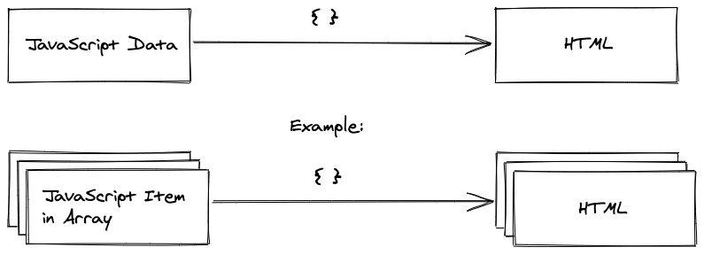

## hello-react

SPA Single-page applications 单页面 1个html

现代JS 从服务器到客服端 ==减少服务器的压力==

## requirements

npm node yarn

## setup

Vite

命令都在*package.json*

```
# Runs the application locally for the browser
npm run dev

# Builds the application for production
npm run build
```

## Meet the React Component

每个react应用都是在react组建的基础上构建的

1. 不同于驼峰式命名，组件是`PascalCase`，必须首字母大写  eg.App ，js函数定义的就是函数式组件 （还有别的方式的组件）
2. 暂时不会向组件传参，组件间借助 `props`
3. js返回了html，jsx能让你在js里写html，避免了原生的DOM操作

就像普通的函数，return前可以随便写

不想每次运行都重新定义变量，那就写到外面去

变量写死的话就丢在外面，别放函数里面

 

index.html 是根html ，main.jsx是入口文件 ，主要修改App.jsx

## JSX

 why `htmlFor` ?

jsx和js关系更近，遵循驼峰命名 ， class → className ，onclick → onClick

react用虚拟DOM储存DOM元素


在大括号里写js

jsx是js语法层面的扩展

## List in React

react里，map()方法经常用来把每一个元素变成jsx

```react
let array = ['Hello','React','JSX','Components']

function App() {

  return (
    <div className="App">
        {array.map((item) => <h1>{item}</h1>)}
     </div>
  )
}
```

​    `{list.map(item => <h1>{item.title}</h1>)}`




  `{list.map(item => <h1 key = {item.objectID}>{item.title}</h1>)}`

可以看到开发者工具里面 `<h1>`并没有key这个属性，so why？

每当React重新渲染list，用来检查这个item是否改变


[渲染列表 – React (reactjs.org)](https://zh-hans.reactjs.org/learn/rendering-lists#keeping-list-items-in-order-with-key)

React 里需要 key 和文件夹里的文件需要有文件名的道理是类似的。它们（key 和文件名）都让我们可以从众多的兄弟元素中唯一标识出某一项（JSX 节点或文件）。即使元素的位置在渲染的过程中发生了改变，它提供的 `key` 值也能**让 React 在整个生命周期中一直认得它**。

## Meet another React Component

先前都住在操作 App这个组件

写一个巨大的组件  传统

把一整个文件拆分成很多组件

抽离出一个List组件 

```React
function List(){
  return(
      <div>
        {list.map(item => {
          return (
            <ul key={item.objectID}>
              <li>{item.title}</li>
              <li>{item.author}</li>
              <li>{item.url}</li>
            </ul>
          );
        })}
      </div>  //需要封装在一个根元素里
  )
}
```

App,List,Search 


组件树

App是根组件，List和Search是App的子组件，它们互为兄弟组件

小组件可能是写完后发现可以抽离出来的 

根里面一般就写组件

觉得组件太大太复杂那就抽离

## React Component Instantiation

组件实例化

每个类都有构造函数，当实例化的时候，调用构造函数去创建新变量

类是一个蓝图，实例是建出来的房子

类和组件的声名和实例化挺像的，一个声明，多个实例

## React DOM

App组件的实例在main.jsx

React DOM 把 React 和 HTML （index.html）连接起来

非常小的html接收到巨大的js

目前来说静态的还体会不到好处，一旦有了数据...

## React Component Declaration

函数式声明和箭头函数可以，但

箭头函数好！ 碰到this丢失再说！

```react
const App = () => {
  // perform a task in between

  return (
    <div>
      ...
    </div>
  );
};
```

## Handler Function in JSX

处理事件

到目前为止还没交互

原生HTML `addEventListener` 来监听事件，JSX `onChange`

synthetic event是对原生事件的包装，有些默认事件是需要禁止的（原生提交表单会触发刷新，但React里不允许刷新）。如果真的需要用原生事件，用`event.nativeEvent`，但基本用不到

**传函数，而不是函数返回值，除非返回值是函数**

```react
const handleChange = (e) => {
  console.log(e);
  console.log(e.currentTarget);
  console.log(e.currentTarget.value);
}

const Search = () => {
  return (
    <div>
      <label htmlFor="search">Search: </label>
      <input id="search" type="text" onChange = {handleChange}/>
    </div>
  );
}
```

阻止事件传播 `e.stopPropagation()`

阻止默认行为  `e.preventDefault()`

## Props

我们通过组件元素的HTML属性从父组件传递给子组件的所有东西都可以在子组件中访问。 子组件在其函数签名中接收一个参数（`props`）作为对象，其中包括所有传递的属性（简称：props）。

只能从上往下传 父到子

```react
const App = () => {
  const stories = [...];
  return (
    <div>
       	...
         <List list = {stories}/>
    </div>
  )
};

//解构赋值写法
const List = ({ list }) => {
  return(
      <ul>
        {list.map((item) => (
          <Item 
            title = {item.title} 
            author = {item.author} 
            url = {item.url}  
            key = {item.objectID} 
          />
        ))}
      </ul>
  )
}

const Item = ({title, author, url}) => {
  return (
    <ul>
      <li>{title}</li>
      <li>{author}</li>
      <li>{url}</li>
    </ul>
  );
}
```

